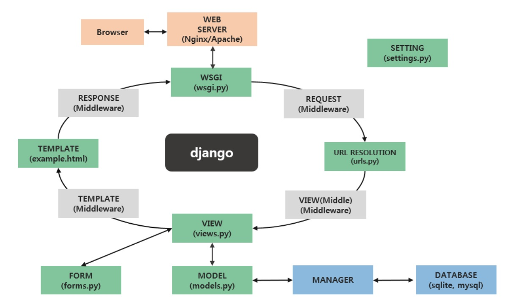

# 📜 DJango Bootstrap web project  

 

# 📝Projects

### [1] 미니 블로그 만들기

|프로젝트 명| 사용언어 | 개발기간 | 목적 |
|---|---|---|---|
|미니 블로그| DJango, Bootstrap, Mysql | 2025.07 ~ 2025.08 | 장고 프레임웤을 이용하여 미니 프로젝트를 만듦. |

 

#### 프로젝트 설명
> 미니 블로그를 작성

#### 간트 차트
[7월 ~ 8월 프로젝트 구현 계획](/ganttchart0728.pdf)

#### WBS (Work Breakdown Structure) 페이지 구성
[각 페이지 구성도](/wbs0728.pdf)

#### ERD 개념도
[개념적 논리설계도](/conceptual_sql.erd)

#### 파일 생성도
> 장고 프로젝트를 할 때 만들어 지는 개괄적인 파일 그래프입니다. 참고용으로 개시합니다.
> 출처: https://chiefcoder.tistory.com/23

> &copy; 2025 07 28 topchung12@gmail.com  